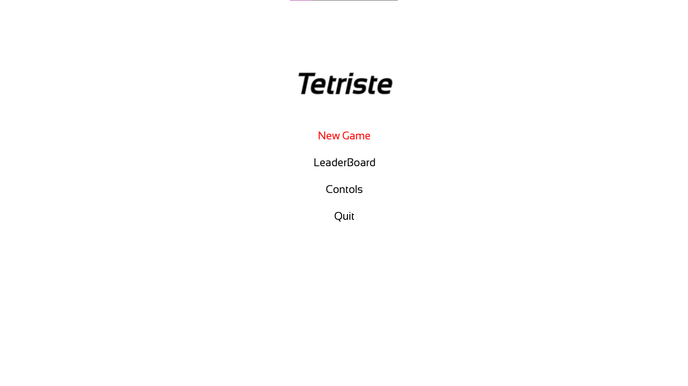
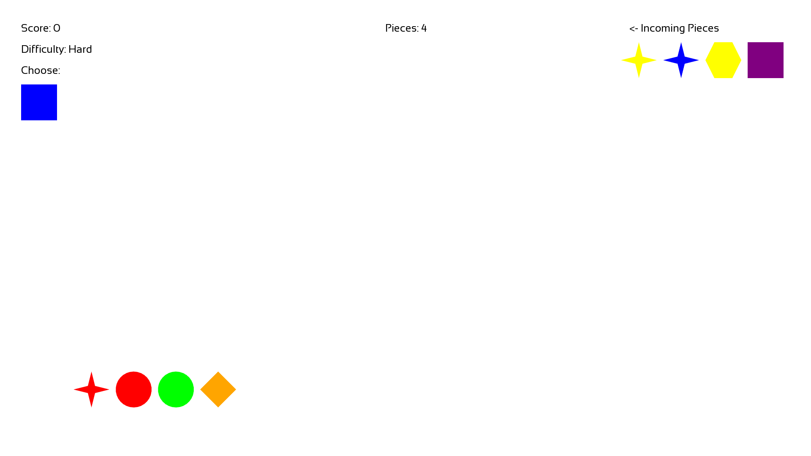

# Tetriste  - A Simple Tetris Game

## Description
This is a simple game project written in C++ using the SFML library. The game is called Tetriste.

## Build Project
```cmake -S src -B build```

## Run Project
```cmake --build build```

## Executable Path
```./build/bin/Tetriste.exe```